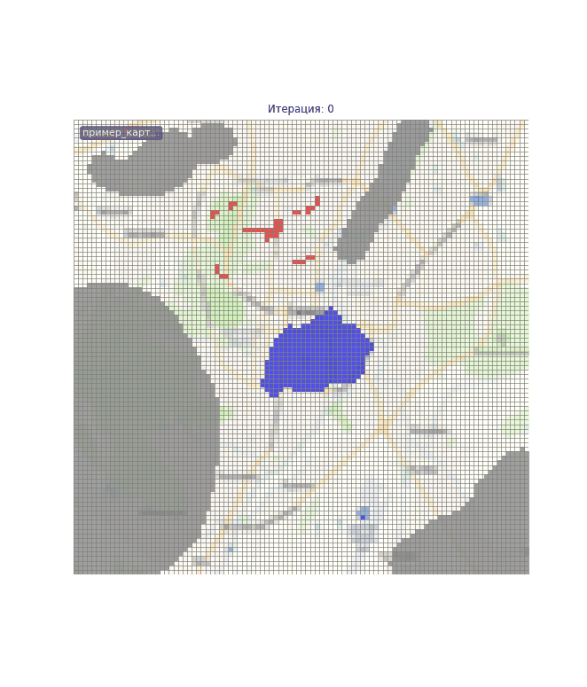
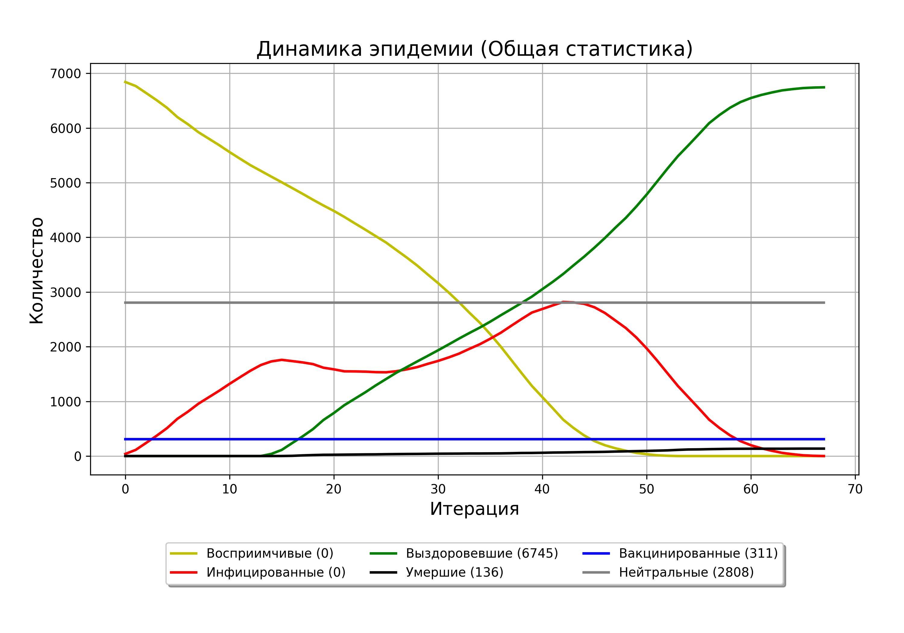
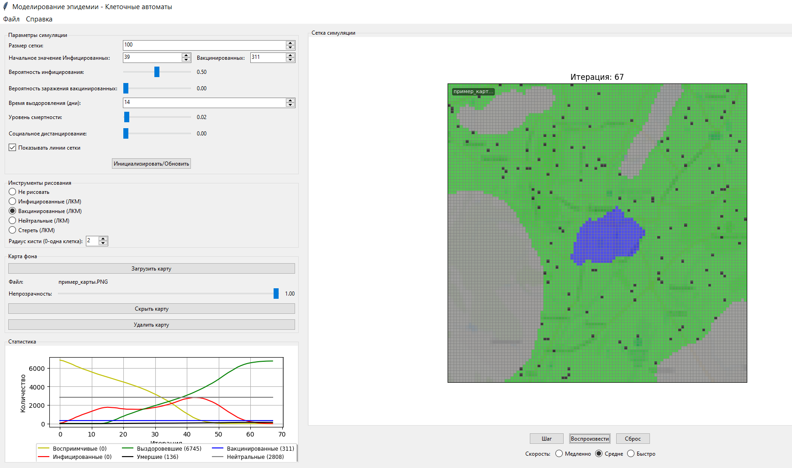

# Моделирование распространения эпидемии методом клеточных автоматов


## 📌 Описание проекта

Этот проект представляет собой настольное приложение на Python, предназначенное для моделирования распространения инфекционных заболеваний с помощью метода клеточных автоматов. Программа визуализирует эпидемиологический процесс на двумерной сетке и позволяет пользователю настраивать ключевые параметры модели (инфекционность, продолжительность болезни, уровень вакцинации и др.).

## 🎞️ Анимация распространения эпидемии



Пример динамики распространения инфекции в сетке клеток.

## 📊 Пример графика статистики



На графике показано динамическое изменение численности различных групп клеток (восприимчивых, инфицированных, выздоровевших и умерших) во времени. График обновляется в реальном времени с каждой итерацией модели.

## 🎯 Цели и возможности

- Моделирование распространения инфекции по клеточному полю;
- Визуализация текущего состояния популяции;
- Интерактивная настройка параметров симуляции;
- Отображение статистики в графическом виде;
- Поддержка пользовательского ввода начальных условий;
- Импорт/экспорт изображений и анимаций процесса;
- Возможность загрузки фоновых карт.

## 🛠️ Технологии

- **Язык программирования:** Python
- **GUI:** Tkinter
- **Обработка данных:** NumPy
- **Визуализация:** Matplotlib, Pillow

## 🧠 Теоретическая база

Проект опирается на метод клеточных автоматов, где каждая клетка может находиться в одном из следующих состояний:

- 🟨 **Восприимчив** (`Susceptible`) — клетка уязвима к инфекции  
- 🟥 **Инфицирован** (`Infected`) — клетка заражена и может заразить соседей  
- 🟩 **Выздоровевший** (`Recovered`) — переболел, иммунитет есть  
- ⬛ **Умерший** (`Dead`) — клетка больше не участвует в симуляции  
- 🟦 **Вакцинированный** (`Vaccinated`) — имеет частичную или полную защиту от инфекции  
- ⬜ **Нейтральный** (`Neutral`) — играет роль барьера, не взаимодействует с инфекцией

Состояние клетки изменяется в зависимости от состояния соседей и заданных параметров модели (вероятность заражения, уровень социального дистанцирования и т.п.).

Формула вероятности заражения восприимчивой клетки при наличии 8 заражённых соседей:
```
P = 1 - (1 - p * (1 - d))^8
```
где `p` — вероятность заражения, `d` — социальное дистанцирование.

## 📸 Интерфейс



На изображении выше показан графический интерфейс программы, включающий:
- Панель параметров симуляции
- Поле клеточного автомата с цветовой индикацией состояний
- График распространения эпидемии по времени
- Панель рисования начальных условий
- Возможность загрузки карт фона

## 🔍 Примеры применения

- Образование: демонстрация принципов эпидемиологии
- Научные исследования: анализ сценариев распространения инфекции
- Здравоохранение: оценка стратегий вмешательства (вакцинация, дистанцирование)

## 📦 Установка и запуск

1. Клонируйте репозиторий:
```bash
git clone https://github.com/skailHZ/epidemic-simulation.git
```
2. Перейдите в папку проекта:
```bash
cd epidemic-simulation
```
3. Установите зависимости:
```bash
pip install -r requirements.txt
```
4. Запустите программу:
```bash
python EpidemicSimulationApp.py
```

## 📥 Скачать готовую версию

📎 [Скачать v1.0 (Windows .exe)](https://github.com/skailHZ/epidemic-simulation/releases/download/v1.0/EpidemicSimulation_v1.0.rar) 

✔️ Для запуска не требуется установка Python  
📁 Архив содержит:
- `EpidemicSimulation.exe`
- Папку `images`
- Лицензию MIT
- Краткое руководство

## 📄 Лицензия

Проект выложен в открытый доступ в портфолио-целях. 
Использование в образовательных целях приветствуется. 
Для коммерческого использования обратитесь к автору.
